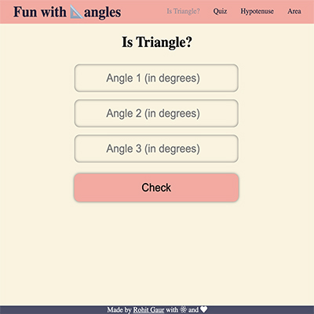

# Fun with Triangles

It is a web app made with React. React Router is used to handle frontend routing.

Features:

- Enter the angles and check if they make up to a triangle
- Play a quiz on triangles
- Calculate the hypotenuse side by entering the other two
- Calculate the area of triangle

### Website: [Fun with Triangles](https://m4v3w.csb.app/)
